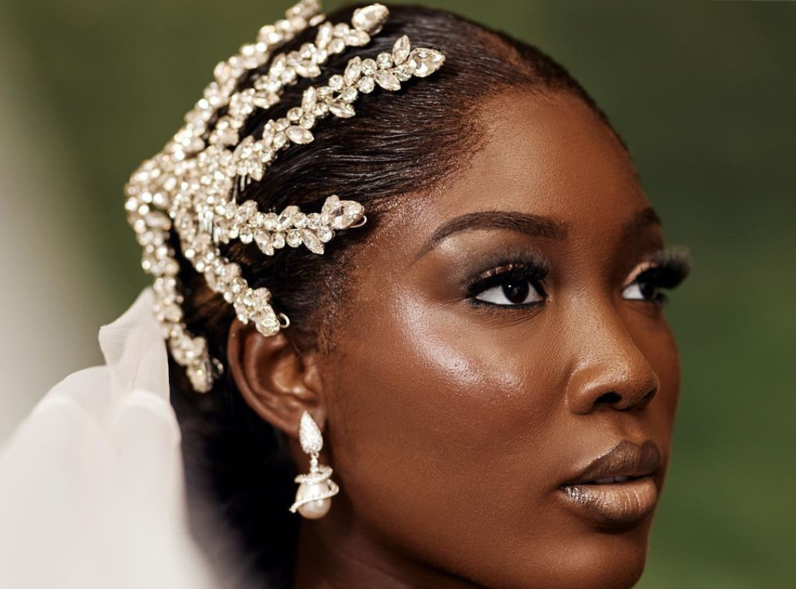

# Crown of Achievements:

Ololade Ayelabola's venturing into the world of beauty pageants has been marked by several significant victories. She first captured attention by winning the prestigious Miss Amina 2019 title, a feat that highlighted her poise, intelligence, and beauty. The same year, she was crowned Miss Unique 2019, further cementing her status as a formidable competitor in the pageantry circuit. 
Her achievements didn't stop there; she went on to win the Face of Akoka, Lagos State, a recognition that celebrates not just physical beauty but also cultural representation and community involvement.

In 2021, Ololade reached another milestone by winning the Most Beautiful Campus Queen Nigeria (MBCQN), an honor that celebrates the country's most stunning and talented university queens. This accolade recognized her as a role model for young women across Nigeria, showcasing her ability to balance academics, modeling, and social commitments.

Ololade's journey in the world of beauty pageants has been nothing short of remarkable. After winning the prestigious Miss Amina 2019 title, she solidified her position as a formidable competitor by also being crowned Miss Unique 2019. Her success continued with the recognition of winning the Face of Akoka, Lagos State, which celebrates not only physical beauty but also cultural representation and community involvement.

In 2021, Ololade achieved yet another milestone by winning the Most Beautiful Campus Queen Nigeria (MBCQN) award. This honor not only acknowledges her stunning beauty but also highlights her ability to excel in academics, modeling, and social commitments. She has become a role model for young women across Nigeria.

## A Multitalented Inspiration:
It might interest you to know that Queen Ololade has other talents and passions. She has always worked circumspectly in all spheres even at a very young age, which made her distinct amongst peers at her early stage in life. Aside from desiring to be a well-renowned model, she also has great talent in dancing and has won different in-house dancing competitions, even at public fairs. Ololade also displayed her great acting skills, which moved the judges and audience at the competition where she was crowned Miss Amina. 

She is indeed a lady of diverse talents. Above all, this unique model has a burning passion for the gospel of Christ. She is graced and has been a young pastor for many years. Her project management skills surfaced when she was made head of department for an investment firm, she was awarded best staff of the year. One stunning thing about Ololade is she never quits; whatever she sets her heart to do, she executes it flawlessly and excellently.

