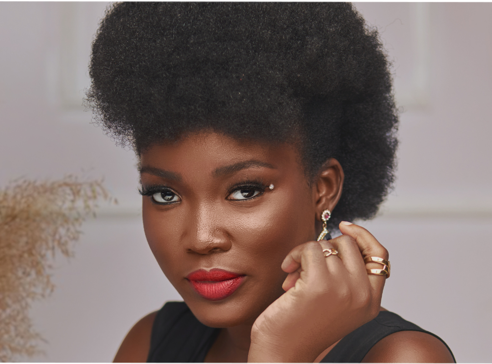

# Entrepreneurial Foray:

Beyond the glitz and glamor of pageantry, Ololade Ayelabola is a dynamic entrepreneur. She has ventured into several business fronts, demonstrating her versatility and business insight. 
Her entrepreneurial spirit is fueled by a desire to create opportunities and empower others, particularly young ladies who look up to her as an inspiration. 

Through her businesses, Ololade provides platforms for aspiring models and beauty queens, offering mentorship and support to help them achieve their dreams. Lade who believes that dreams can be achieved is setting up a fashion house, a modeling academy, a pageantry coaching hub to mention a few and  now attempting the Guinness World Record for the longest distance catwalk by a female model.

